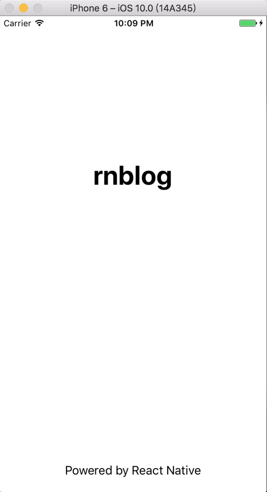
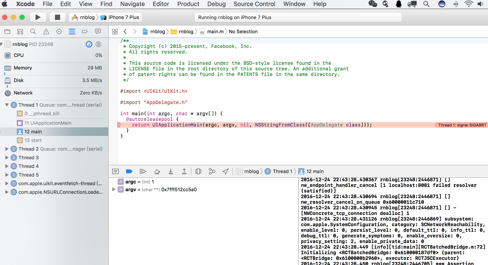
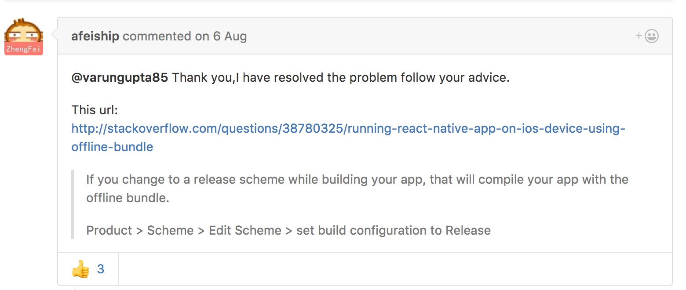
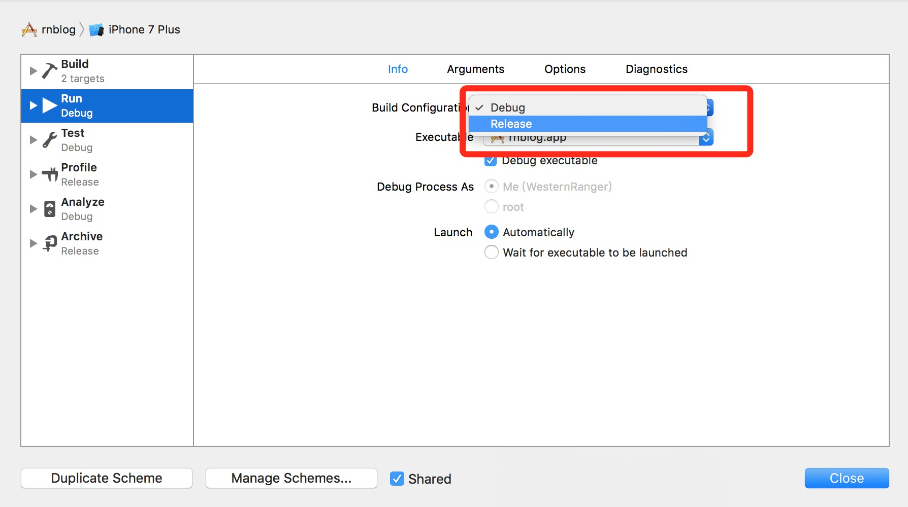
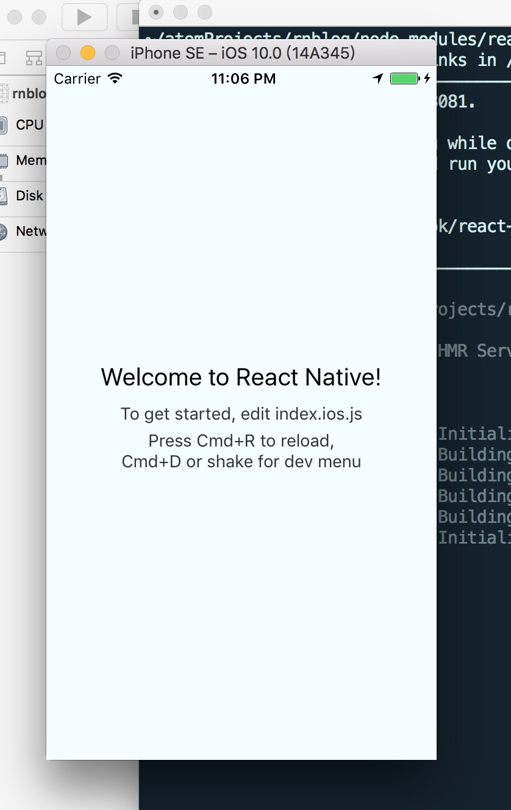

react-native 入坑之 hello world demo

>垂涎react-native已久，初次相识还是半年前，朋友带我入坑，后来不了了之。后来因为工作需要，要经常用webapp跟native交互，学习react-native是为了跟好的跟app native协作。

>我把我写react-native（后文简称RN）demo的过程记录下，共享一下这个过程。首先声明我的开发环境及软件包版本

- 设备 mac

- xcode 8.0

- ios 模拟设备 simulator

- node v6.6.0

- npm v3.10.9

- react-native -V 0.39.2

>虽然RN支持 ios和android 基本共用一套代码，所谓：一处编写，随处运行。但是考虑到刚入门的难度，决定暂且试坑mac + ios 的模式。
可以开干啦，我们就按照[RN中文网](http://reactnative.cn/docs/0.39/getting-started.html)环境搭建教程一步一步来（坑还是很多的）。

  ​
>当你按照官方文档把开发环境配置完毕，并且init了一个官方demo，准备用 `react-native run-ios` 来飞起这个demo的时候，你可能就卡壳了。（如果你完美的看到你的app运行起来了，就不用往下读啦）我这里执行完，simulator打开这个界面后会闪退：

>google 搜索后，大神们会告诉你，把node_modules 删掉，重新执行`npm install`。这里说明下，官方文档已经明确告诉我们使用sudo权限安装node包会遇到各种权限问题的。

>我们因为‘墙’的原因，如果不去翻墙必须用国内的镜像来安装node包，国内node包比较全的就是淘宝镜像了。官方文档也推荐的淘宝镜像。
我有必要安利一个npm 镜像地址管理工具 nrm，这是RN中文网视频教程里那个老师推荐的，超级好用。具体安装使用查看 [nrm切换npm源利器](http://www.jianshu.com/p/5dd18d246281)

>大家可能使用淘宝镜像之后，npm就刷刷的安装好了，然而我却卡壳了，用了几次cnpm，启动app还是会闪屏，纠结了好久，后来我把翻墙代理去掉了就安装好了。。。TT，然而用`react-native run-ios`运行还是会闪屏。

>直接换官网提供的第二种方案 - Xcode运行。打开  `rnblog/ios/rnblog.xcodeproj`，系统默认会使用Xcode打开。然后点击左上角运行按钮，等待simulator打开后，app不闪退了，但是直接停留在打开页面没有进去。
查看我的Xcode是这样的。

>明显报错了，细心一点可以发现右下角有log信息，耐下心来读一遍会发现有这么一段：

`/Users/WesternRanger/atomProjects/rnblog/node_modules/react-native/React/Base/RCTBatchedBridge.m:196
2016-12-24 22:43:28.460 rnblog[23248:2446705] *** Terminating app due to uncaught exception 'NSInternalInconsistencyException', reason: 'bundleURL must be non-nil when not implementing loadSourceForBridge'`

>截取重要部分 `Terminating app due to uncaught exception 'NSInternalInconsistencyException', reason: 'bundleURL must be non-nil when not implementing loadSourceForBridge'` 放到google里搜一下，我得到[这个解答](https://github.com/facebook/react-native/issues/9206)

按照大神说打开后是这样滴：

默认选择的Debug，改成Release。再次运行，终于成功了。

可以改动下项目里index.ios.js里的文案在simulator里试试看。

--by WesternRanger
